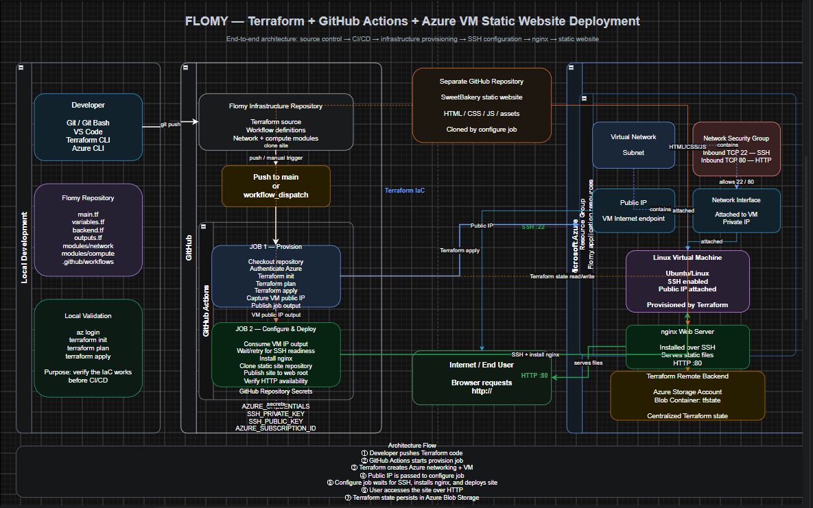
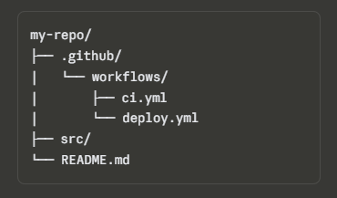
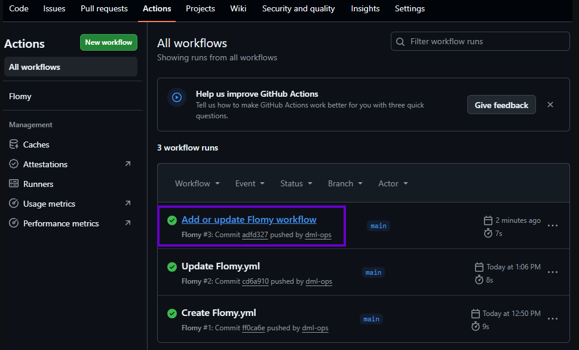
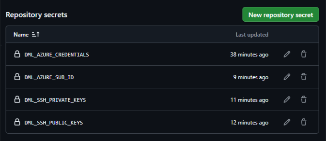
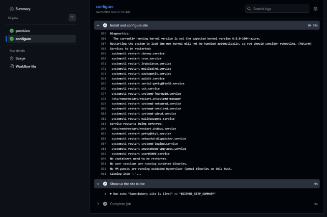
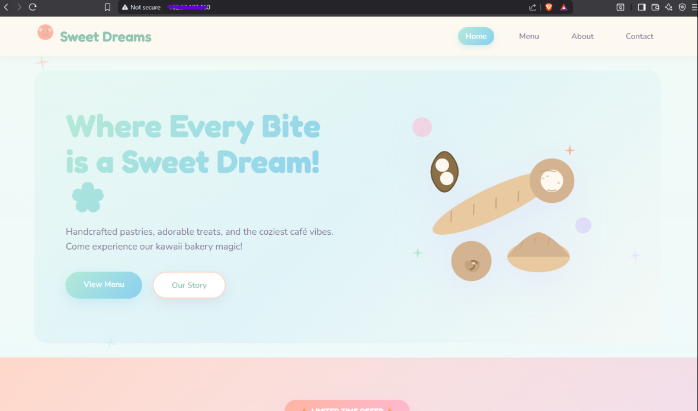

# Flomy 🍞☁️

**Provisioning, configuring, and deploying a website on an Azure VM, fully automated with Terraform and GitHub Actions.**




## Overview

Flomy started as a simple question: what happens after `terraform apply` works from your own laptop? This project answers that by taking a Terraform setup that already knew how to build a resource group, virtual network, subnet, public IP, NSG, NIC, and Linux VM in Azure, and wiring it into a GitHub Actions pipeline so the whole thing runs itself.

Every push to `main` now triggers a two stage pipeline. The first stage stands up the infrastructure in Azure. The second stage waits for that VM to be reachable, SSHes into it, installs nginx, pulls down a static site from a separate GitHub repo, and serves it. No manual steps, no sitting at a terminal typing commands, just `git push` and a live website a few minutes later.

The demo site being deployed is a static bakery template called SweetBakery, but the pipeline itself is written to be reused for any static site you want to point it at.

## Technologies Used

* **Terraform** for defining and provisioning Azure infrastructure as code
* **GitHub Actions** for CI/CD automation and orchestrating the deploy pipeline
* **Microsoft Azure** as the cloud provider (resource group, VNet, subnet, public IP, NSG, NIC, VM)
* **Azure CLI** for creating the service principal and managing resources locally
* **nginx** as the web server running on the provisioned VM
* **SSH** for securely configuring the VM once it exists
* **Bash / Git Bash** for local scripting and git workflows
* **Azure Blob Storage** as the remote backend for Terraform state

## Project Structure

```
Flomy/
├── .github/
│   └── workflows/
│       ├── ci.yml            Basic proof of concept workflow
│       └── deploy.yml        Full provision + configure deploy pipeline
├── modules/
│   ├── network/               VNet, subnet, public IP, NSG, NIC, security rules
│   └── compute/                Linux VM resource definitions
├── main.tf                    Root module wiring network and compute together
├── variables.tf                All input variable declarations
├── backend.tf                  Remote state backend configuration (Azure Blob)
├── output.tf                    Terraform outputs, including the VM's public IP
├── .gitignore                    Keeps state files and local Terraform cache out of git
└── README.md
```

The static site itself lives in its own separate repository, which the `configure` job clones directly onto the VM during deployment.

## Main Features

**Two stage pipeline.** The workflow is deliberately split into a `provision` job and a `configure` job. Provisioning is Terraform's responsibility (building the box), while configuring is a set of SSH commands (filling the box). Keeping them separate makes the whole system much easier to reason about and debug.

**Secrets driven authentication.** Nothing sensitive is hardcoded. Azure credentials, SSH keys, and the subscription ID all live as encrypted GitHub repository secrets and get pulled in through `${{ secrets.SECRET_NAME }}` expressions at runtime.

**Job outputs bridge the gap between stages.** Since each GitHub Actions job runs on its own disposable runner with no shared filesystem, the VM's public IP is captured from Terraform's output and passed from `provision` to `configure` using `outputs:`.

**Resilient SSH readiness check.** Since a freshly provisioned VM doesn't accept SSH connections instantly, the pipeline polls the VM in a retry loop before attempting configuration, rather than assuming it's ready the moment Terraform reports success.

**Manual trigger support.** Alongside the automatic push trigger, `workflow_dispatch` adds a "Run workflow" button in the Actions tab, handy for re-running a deploy without needing an empty commit.

**Remote Terraform state.** State is stored in an Azure Blob Storage container rather than locally, so the pipeline (and anyone else on the project) always works from a single source of truth.

**Security rules baked into the network module.** Inbound rules for ports 22 and 80 are defined explicitly inside the network module, since an NSG with no rules attached blocks everything by default.

## Setup Instructions

### 1. Clone the repository

```bash
git clone https://github.com/dml-ops/Flomy.git
cd Flomy
```

### 2. Install prerequisites locally

You'll want the Azure CLI and Terraform installed on your own machine at least once, so you can confirm `terraform apply` works before handing it off to GitHub Actions.

```bash
az login
terraform init
terraform plan
```

### 3. Create an Azure service principal

```bash
MSYS_NO_PATHCONV=1 az ad sp create-for-rbac --name hagital --role Owner \
  --scopes /subscriptions/<your-subscription-id> --sdk-auth
```

This prints a JSON credentials blob. Keep it handy, you'll paste it into a GitHub secret in the next step.

### 4. Generate an SSH key pair

```bash
cd ~/.ssh
cat ~/.ssh/id_rsa       # private key
cat ~/.ssh/id_rsa.pub   # public key
```

### 5. Add repository secrets

In your repo, go to **Settings → Security → Secrets and variables → Actions → New repository secret**, and add the following four secrets:

* An Azure credentials secret holding the full service principal JSON blob
* An SSH private key secret holding the contents of `id_rsa`
* An SSH public key secret holding the contents of `id_rsa.pub`
* A subscription ID secret holding your raw Azure subscription ID (no quotes)

### 6. Configure your remote backend (optional but recommended)

```bash
az group create --name tfstate-rg --location "South Africa North"

az storage account create \
  --name tfstateflomy2026 \
  --resource-group tfstate-rg \
  --location "South Africa North" \
  --sku Standard_LRS \
  --encryption-services blob

az storage container create \
  --name tfstate \
  --account-name tfstateflomy2026 \
  --auth-mode login

terraform init
```

When prompted to copy existing state into the new backend, type `yes`.

## Workflow Usage Guide

Once your secrets and backend are in place, using the pipeline is genuinely as simple as pushing code.

**Trigger a deploy automatically**

```bash
git add .
git commit -m "Update deployment"
git push origin main
```

**Trigger a deploy manually**

Head to the **Actions** tab in your repository, select the deploy workflow, and click **Run workflow**.

**Watch it run**

Open the Actions tab and click into the running workflow. You'll see the `provision` job build out the Azure infrastructure first, followed by the `configure` job waiting for SSH and then installing nginx and pulling the site.

**Find your live site**

Once both jobs finish successfully, expand the "Wait for SSH" step in the `configure` job and copy the VM's public IP address. Alternatively, open the Azure portal, find the resource group that was created, and grab the public IP from the VM's networking blade. Paste the IP into your browser using `http://`, since the demo site doesn't run TLS.

**Recover from a failed run**

If a job fails partway through (a stale resource group, a missing security rule, whatever it may be), fix the underlying issue, then go to Actions → the failed workflow → **Re-run jobs → Re-run all failed jobs** rather than starting over from scratch.

## Screenshots

Below are placeholders for the key images referenced in the original write up. Swap these out with your own images from your Actions tab and Azure portal.











## Lessons Learned Along the Way

A few real issues came up while building this out, each one teaching something worth remembering.

A Terraform plan step that hangs forever on a headless runner almost always means a required variable was left out and Terraform is silently waiting on a prompt nobody can answer.

Cheap or free tier VM sizes aren't always available in every Azure region, so it's worth having a backup size like `Standard_B2s` or `Standard_D2s_v3` ready to go.

"Resource group already exists" errors usually mean Terraform's state has drifted from what's actually in Azure, most often after a manual delete outside of Terraform.

An NSG with no rules attached blocks everything by default, so ports like 22 and 80 need explicit inbound rules before SSH or HTTP will work at all.

## Credit

Created by Ademola Adebayo
The full story, including every bug encountered along the way, is documented in the original blog post on Hashnode.


